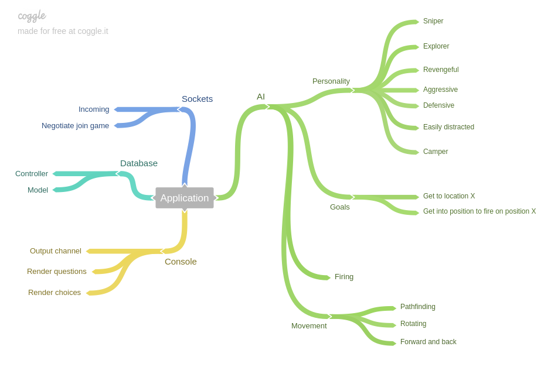
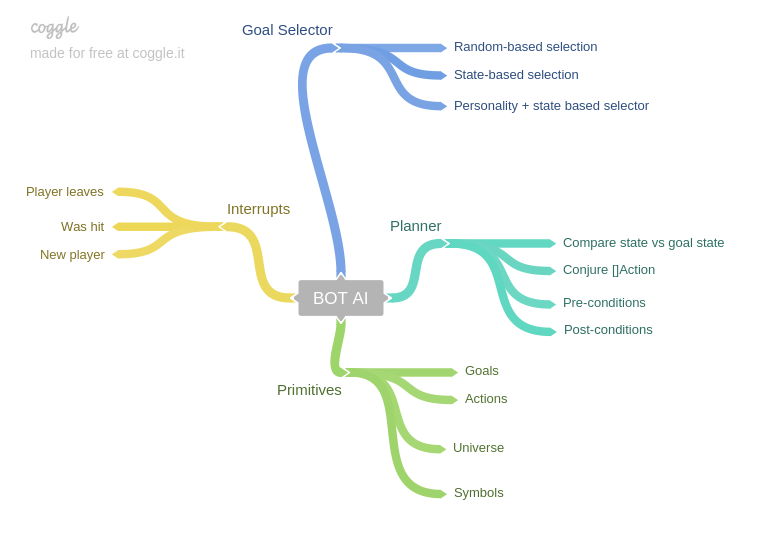

# GG Bot (Captain version 🛳️🛳️🛳️)

## Project
The goal of this project is to build a bot for GG - the game with no name. The bot will be built using Goal Oriented Action Planning, once I understand it a bit better.

 
https://github.com/team142/gg

## Road map

## AI planning

## Planning & progress

## Community (Dev, Q&A & suggestions)

